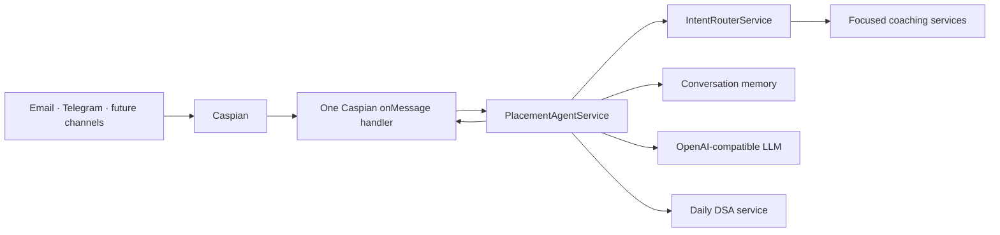

# AI Placement Preparation Agent

An AI coach that helps college students prepare for software-engineering internships and placements over the channels they already use. It uses the **Caspian TypeScript SDK** for communication, an OpenAI-compatible LLM for coaching, and one shared message handler for all channels.

## Problem statement

Placement preparation is fragmented: students practice DSA in one tool, interview questions in another, and resume feedback somewhere else. This service offers a focused coaching experience in a student’s existing inbox or chat, while keeping conversation context and channel plumbing out of the core product logic.

## Features

- DSA problems, explanations, hints, and approach reviews
- Deterministic daily DSA challenge, so every student gets the same daily exercise
- HR and behavioral mock interviews, one question at a time
- Resume-feedback guidance from pasted resume text
- System-design fundamentals, DBMS, OS, CN, OOP, and aptitude practice
- Conversation-scoped durable memory and a `reset` / `/clear` command
- Pluggable intent routing for resume review, interviews, DSA, roadmaps, behavioral practice, help, and general coaching
- Email and Telegram via one Caspian `onMessage` handler
- Typing indicators where Caspian’s provider supports them
- Concise, channel-aware coaching prompts
- User-safe behavior for LLM timeouts, rate limits, network errors, invalid LLM keys, empty messages, and Caspian delivery errors
- Offline unit tests that mock all external APIs

## Architecture



For the detailed design rationale, see [docs/architecture.md](docs/architecture.md).

## Tech stack

- Node.js 20+, TypeScript, Express
- [Caspian SDK](https://github.com/TryCaspian/caspian-sdk) for multi-channel communication
- OpenAI-compatible Chat Completions API via native `fetch`
- Vitest for fast, offline unit tests

## How Caspian is used

`src/communication/caspian.service.ts` is the only communication integration point. At startup it connects Email and, when enabled, Telegram. It registers a single `client.onMessage(...)` handler; Caspian handles transport-specific delivery, threading, and reply routing.

The handler delegates every message to the same controller and replies with `message.reply(...)`. No Telegram-specific or Email-specific business logic exists. To enable another supported Caspian channel, add one connection call in `connectConfiguredChannels()`—the agent, memory, prompts, and controller stay unchanged.

## Intent routing

`IntentRouterService` sits behind the existing `PlacementAgentService` façade. It delegates requests to focused services for resume review, interviews, DSA, roadmaps, behavioral preparation, and help. Its detector is an `IntentDetector` interface; `DeterministicIntentDetector` is the initial rules-based implementation, and can later be replaced with an LLM or profile-aware detector without changing the router or Caspian integration.

Progress wording currently reaches `GeneralCoachService`, because persistent profile and progress tracking are intentionally deferred to the profile phase.

## Project structure

```text
src/
  communication/  Caspian adapter and one inbound handler
  config/         environment validation and .env loading
  controllers/    delivery-to-application translation
  llm/            OpenAI-compatible client and typed errors
  prompts/        placement-coach system prompt
  routes/         thin Express health route
  services/       agent, memory, and daily challenge logic
  types/          shared application contracts
  utils/          structured logger
test/             isolated unit tests with mocked network calls
docs/             architecture and screenshot capture guide
```

## Setup

1. Install Node.js 20 or newer.
2. Copy the example environment file and set the values:

   ```bash
   cp .env.example .env
   ```

3. Set `CASPIAN_API_KEY`, `LLM_API_KEY`, and the LLM endpoint/model. The application defaults to Email. To enable Telegram, set `CASPIAN_ENABLE_TELEGRAM=true` and provide `TELEGRAM_BOT_TOKEN`.
4. Install and run:

   ```bash
   npm install
   npm run dev
   ```

The HTTP health endpoint is available at `GET /health`. The Caspian listener runs in the same process.

## Commands

```bash
npm run dev       # local development with restart
npm run build     # compile TypeScript to dist/
npm start         # run compiled service
npm test          # run offline unit tests
npm run typecheck # validate types without emitting files
```

## Example conversations

**Student:** Give me today's DSA problem  
**Coach:** Returns a daily problem, difficulty, concepts, prompt, and a time-boxed next step.

**Student:** Mock HR interview  
**Coach:** Starts with one realistic question and waits for the student’s response before probing further.

**Student:** Quiz me on DBMS  
**Coach:** Begins a one-question-at-a-time quiz; later messages retain the conversation context.

**Student:** Review my resume  
**Coach:** Asks the student to paste the resume text if it was not included, then gives structured, actionable feedback.

**Student:** reset  
**Coach:** Clears only that student conversation’s stored context.

## Deployment

Build the service with `npm run build`, supply environment variables through your hosting platform’s secret manager, and persist `MEMORY_FILE` on durable storage. Run it as a long-lived Node process—the Caspian SDK polls inbound events from the gateway. Expose the Express `/health` endpoint to the platform’s health checker.

For multi-instance production deployment, replace `FileConversationMemory` with a shared database implementation of its small `ConversationMemory` interface. This preserves per-conversation ordering and history across replicas.

## Screenshots

The repository includes a safe [screenshot capture guide](docs/screenshots.md). Add redacted real-channel captures before publishing a product demo.

## Future roadmap

- Database-backed encrypted memory with retention controls
- Resume document ingestion with explicit user consent
- Scheduled revision plans and reminders using Caspian’s proactive messaging APIs
- Progress analytics and skill-gap dashboards
- Human mentor handoff and feedback review workflows
- Per-institution question banks and aptitude assessment modes

## Security and privacy

Keep `.env` and the local `data/` memory directory out of source control. Do not log resume content, messages, API keys, or personally identifiable information. In production, encrypt stored conversation data and define a deletion policy appropriate for your institution.
