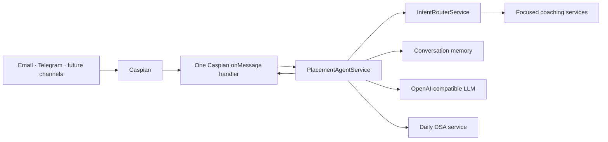

# PlacementOS — AI Placement Preparation Agent

PlacementOS is a production-ready AI placement coach that helps computer science students prepare for software engineering internships and campus placements through the communication channels they already use. Built on the Caspian TypeScript SDK, it combines deterministic coaching workflows with LLM-powered explanations to deliver personalized interview practice, DSA guidance, resume reviews, and placement preparation from a single conversational interface.

Unlike traditional AI chatbots, PlacementOS separates deterministic decision-making from language generation. Intent routing, daily challenge selection, conversation memory, resume analysis, and coaching workflows are handled by modular application services, while the language model focuses solely on generating natural explanations and feedback.

## Problem Solved

Preparing for software engineering placements typically requires students to switch between multiple disconnected platforms for DSA practice, resume reviews, interview preparation, aptitude training, and behavioral coaching. PlacementOS brings these capabilities together behind a single conversational interface, allowing students to continue preparation from email or messaging applications without changing tools or losing context.

The platform uses Caspian as its communication layer, enabling the same coaching experience across supported channels through a single message handler while keeping channel-specific logic completely separate from business logic.

## Features

- Deterministic intent routing for DSA practice, resume reviews, technical interviews, behavioral interviews, roadmaps, aptitude preparation, and general coaching
- Adaptive interview engine supporting technical and HR interview workflows with multi-turn conversational context
- ATS-aware resume intelligence providing structured resume feedback and actionable improvement recommendations
- Daily deterministic DSA challenges with topic selection, hints, solution guidance, and approach reviews
- Personalized placement preparation covering Data Structures & Algorithms, Operating Systems, DBMS, Computer Networks, Object-Oriented Programming, System Design fundamentals, and aptitude
- Conversation-scoped durable memory that preserves coaching history while supporting explicit reset through the `/clear` command
- Unified coaching experience across multiple communication channels using a single Caspian message handler
- Channel-aware responses with typing indicators where supported by the connected provider
- Modular service-oriented architecture that cleanly separates communication, business logic, intent detection, memory, and LLM interactions
- Structured error handling for LLM failures, network interruptions, invalid credentials, empty requests, and Caspian delivery failures
- Fully offline unit tests with mocked external dependencies for deterministic and reproducible test execution

## Code Quality

The project emphasizes deterministic application behavior over prompt-driven orchestration. Business workflows such as intent routing, conversation memory, daily challenge generation, resume analysis, and coaching flows are implemented as modular application services, while the language model is responsible only for natural-language reasoning and explanations.

Engineering highlights include:

- Strict TypeScript with shared domain models and typed service interfaces
- Modular service-oriented architecture with clear separation of concerns
- Deterministic intent detection behind a pluggable IntentDetector abstraction
- Conversation-scoped durable memory with reset support
- Channel-independent communication through a single Caspian message handler
- Structured error handling for LLM, network, and delivery failures
- Offline unit testing with mocked external APIs
- Health endpoint for deployment readiness
- Environment validation and centralized configuration management
- Structured logging and dependency injection for maintainability

## Verification

The project is validated through automated testing, static analysis, and end-to-end manual verification.

- 46 offline unit tests across 19 test suites pass successfully.
- Strict TypeScript type checking passes with `npm run typecheck`.
- Production build completes successfully with `npm run build`.
- External services are fully mocked during testing for deterministic and reproducible execution.
- Health endpoint verified locally.
- End-to-end manual validation completed through Caspian Email, including inbound message delivery, intent routing, conversation memory, LLM response generation, and outbound replies.

## Architecture



For the detailed design rationale, see [docs/architecture.md](docs/architecture.md).

### High-Level Architecture

```
                Caspian SDK
                     │
           client.onMessage(...)
                     │
             Placement Controller
                     │
             Intent Router Service
                     │
 ┌──────────┬──────────┬──────────┬──────────┐
 │          │          │          │          │
DSA     Resume     Interview   Roadmap   Coach
Service  Service    Service    Service   Service
 │          │          │          │
 └──────────┴──────────┴──────────┴──────────┘
                     │
          Conversation Memory
                     │
         OpenAI-Compatible LLM
```


## Tech stack

- Node.js 20+, TypeScript, Express
- [Caspian SDK](https://github.com/TryCaspian/caspian-sdk) for multi-channel communication
- OpenAI-compatible Chat Completions API via native `fetch`
- Vitest for fast, offline unit tests

## How Caspian Fits

Caspian serves as the communication layer rather than an additional notification channel. The application uses a single `client.onMessage(...)` handler to process every inbound message, regardless of the connected communication platform.

The handler delegates requests to the application controller, which routes them through the intent router and coaching services before returning responses using `message.reply(...)`. Business logic never depends on Email, Telegram, or any other specific transport.

Conversation IDs provided by Caspian scope durable conversation memory, allowing coaching sessions to continue naturally across multiple messages while remaining isolated from other users.

Adding another supported communication channel requires only a new connection inside `connectConfiguredChannels()`. The coaching engine, intent routing, memory management, prompts, and application services remain unchanged.

**Channels currently verified:** Caspian Email.

The same architecture supports additional Caspian channels such as Telegram without requiring changes to the core coaching logic.

## Intent routing

`IntentRouterService` sits behind the existing `PlacementAgentService` façade. It delegates requests to focused services for resume review, interviews, DSA, roadmaps, behavioral preparation, and help. Its detector is an `IntentDetector` interface; `DeterministicIntentDetector` is the initial rules-based implementation, and can later be replaced with an LLM or profile-aware detector without changing the router or Caspian integration.

Progress wording currently reaches `GeneralCoachService`, because persistent profile and progress tracking are intentionally deferred to the profile phase.

## Project Structure

```
src/
├── communication/    Caspian communication layer
├── config/           Environment validation and configuration
├── controllers/      Request orchestration
├── llm/              OpenAI-compatible client and typed errors
├── prompts/          System prompts
├── routes/           Express health endpoints
├── services/         Coaching services and business logic
├── storage/          Conversation and profile persistence
├── types/            Shared domain models
├── utils/            Logging and shared utilities
test/                 Offline unit tests
docs/                 Architecture and documentation
```

## Demo

The agent has been validated through real conversations over Caspian Email.

Example workflows include:

- Daily DSA challenge generation
- Resume review
- Technical interview simulation
- Behavioral interview practice
- Placement coaching
- Conversation memory across multiple messages


## Setup

1. Install Node.js 20 or newer.
2. Copy the example environment file and set the values:

   ```bash
   cp .env.example .env
   ```

3. Set `CASPIAN_API_KEY`, `LLM_API_KEY`, and the LLM endpoint/model. The application defaults to Email. To enable Telegram, set `CASPIAN_ENABLE_TELEGRAM=true` and provide `TELEGRAM_BOT_TOKEN`.
4. Install and run:

   ```bash
   npm install
   npm run dev
   ```

The HTTP health endpoint is available at `GET /health`. The Caspian listener runs in the same process.

## Commands

```bash
npm run dev       # local development with restart
npm run build     # compile TypeScript to dist/
npm start         # run compiled service
npm test          # run offline unit tests
npm run typecheck # validate types without emitting files
```

## Example conversations

**Student:** Give me today's DSA problem  
**Coach:** Returns a daily problem, difficulty, concepts, prompt, and a time-boxed next step.

**Student:** Mock HR interview  
**Coach:** Starts with one realistic question and waits for the student’s response before probing further.

**Student:** Quiz me on DBMS  
**Coach:** Begins a one-question-at-a-time quiz; later messages retain the conversation context.

**Student:** Review my resume  
**Coach:** Asks the student to paste the resume text if it was not included, then gives structured, actionable feedback.

**Student:** reset  
**Coach:** Clears only that student conversation’s stored context.

## Deployment

The service can be deployed as a long-running Node.js application behind any platform capable of hosting persistent services.

Deployment requirements:

- Configure environment variables through the platform's secret manager.
- Persist conversation storage on durable storage or replace the file-based implementation with a shared database.
- Expose the `/health` endpoint for platform health checks.
- Build the application using `npm run build` and start the compiled service with `npm start`.

For horizontally scaled deployments, replace the file-backed conversation storage with a database implementation of the `ConversationMemory` interface to preserve conversation continuity across multiple instances.

## Screenshots

The repository includes a safe [screenshot capture guide](docs/screenshots.md). Add redacted real-channel captures before publishing a product demo.

## Future Roadmap

- Adaptive interview difficulty based on previous performance
- Persistent learner profiles with long-term skill tracking
- Personalized placement roadmaps generated from interview history
- Resume document ingestion with explicit user consent
- Scheduled revision plans using Caspian proactive messaging
- Institution-specific interview and aptitude question banks
- Mentor review workflows and collaborative coaching
- Analytics dashboard for learning progress and placement readiness

## Security and privacy

Keep `.env` and the local `data/` memory directory out of source control. Do not log resume content, messages, API keys, or personally identifiable information. In production, encrypt stored conversation data and define a deletion policy appropriate for your institution.

## License

This project is released under the MIT License.
