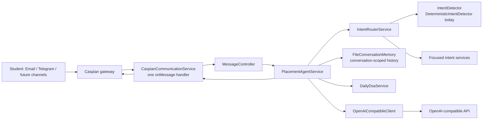

# Architecture

## Design decisions

- **One channel boundary:** `CaspianCommunicationService` owns all connection setup and registers exactly one `onMessage` callback. Adding a Caspian-supported channel is a connection call, not a new bot or route.
- **Thin delivery layer:** the controller translates a Caspian message to an application request and sends the finished response. It does not decide coaching behavior.
- **Pluggable routing:** the router depends on `IntentDetector`, not on keyword rules. The deterministic detector is intentionally replaceable by an LLM- or profile-aware implementation.
- **Conversation isolation:** memory is keyed by Caspian's `conversationId`, so history is retained across messages without leaking between students.
- **Durable local memory:** writes are serialized and atomically replaced. Use a managed database implementation of the `ConversationMemory` interface for horizontally scaled deployments.
- **Resilience:** user-safe LLM failures are converted into short retry messages. Unexpected errors are logged and a Caspian fallback reply is attempted.
